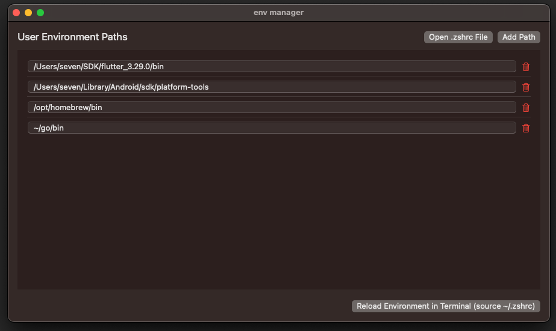
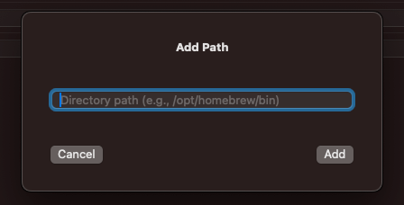

  

<h1 align="center">EnvManager</h1>

A lightweight macOS GUI tool to manage your <code>.zshrc</code> environment variables.

  <a href="#english">English</a> | <a href="./README_zh.md">简体中文</a>

---

# 🧭 EnvManager

**EnvManager** is a minimal macOS app that lets you **visually manage your environment variables**, especially the `PATH`, via your `.zshrc` file. No more editing hidden config files manually.

---

## ✨ Features

- 📂 Display and edit `PATH` entries in your `.zshrc`
- ➕ Add, 🗑️ remove, or ✏️ edit paths with instant saving
- 💾 Automatically backs up your `.zshrc` to `.zshrc.bak`
- 🧱 Creates `.zshrc` if it doesn't exist, with a sane default `PATH`
- 📝 **One-click access** to open the `.zshrc` file in your default editor
- 💻 **One-click "Reload"**: opens Terminal and runs `source ~/.zshrc`
- ⚡ Built with SwiftUI for native performance and a clean UI
- 🌙 Dark mode supported

---

## 📷 Screenshots

### 🔧 Add a path
Simply enter a full directory path. The app will automatically prepend `export PATH="..."` and write it to your `.zshrc`.

---

## 📦 Installation

1. Download the `.app` file from the [Releases](https://github.com/XFSeven7/EnvManager/releases)
2. Move it to your `/Applications` folder
3. On first launch, macOS might ask you to allow opening (System Settings → Privacy & Security)

---

## ⚙️ Usage

1. Launch the app — your `.zshrc` will be loaded and displayed
2. Click **Add Path** to add a new directory (e.g. `/opt/homebrew/bin`)
3. To edit an existing entry, simply type into the field
4. To delete a path, click the red trash icon
5. Click **"Open .zshrc File"** to open it in your default editor if you want to check it manually
6. Click **"Reload Environment in Terminal"** to make your changes take effect in a new terminal window (`source ~/.zshrc` will be run)

🛑 *Note:* Apps cannot update the environment of currently open terminal windows due to macOS sandbox limitations.

---

## 🖥️ Requirements

- macOS 12.0 Monterey or newer
- Works on Intel and Apple Silicon

---

## 🔒 Safe by Design

- Never deletes your `.zshrc`
- Always makes a backup before saving
- Only edits its own block (between `# ==== EnvManager Variables Start ====` and `End ====`)

---

## 🧩 Why this exists

Managing environment variables on macOS can be intimidating. Editing `.zshrc` or `.bash_profile` manually is error-prone, especially for beginners. EnvManager offers a clean, visual alternative without losing control or flexibility.

---
