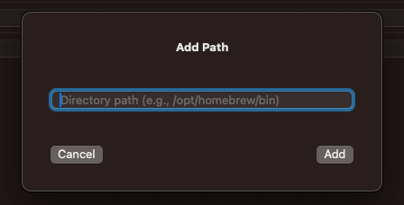

  

<h1 align="center">EnvManager</h1>

一个轻量级的 macOS 可视化工具，用于管理你的 <code>.zshrc</code> 环境变量。

  <a href="./README.md">English</a> | <a href="#简体中文">简体中文</a>

---

# 🧭 EnvManager

**EnvManager** 是一个原生的 macOS 应用，专为简化环境变量（特别是 `PATH`）的配置流程而设计。它提供可视化界面，无需手动编辑隐藏的 `.zshrc` 文件。

---

## ✨ 功能亮点

- 📂 可视化展示并编辑 `.zshrc` 中的 `PATH` 路径
- ➕ 添加、✏️ 编辑、🗑️ 删除路径，实时保存
- 💾 每次保存前自动备份 `.zshrc` 到 `.zshrc.bak`
- 🧱 如果用户没有 `.zshrc`，自动创建并写入默认 `PATH`
- 📝 一键打开 `.zshrc` 文件（使用默认编辑器）
- 💻 一键打开终端并执行 `source ~/.zshrc`，立即生效
- ⚡ 使用 SwiftUI 原生开发，界面美观流畅
- 🌙 支持深色模式

---

## 📷 截图演示

### 🔧 添加路径
只需输入完整的目录路径（如 `/opt/homebrew/bin`），应用将自动补全并写入 `.zshrc`。

---

## 📦 安装方式

1. 前往 [Releases 页面](https://github.com/XFSeven7/EnvManager/releases) 下载 `.app` 文件
2. 将其移动到 `/Applications` 目录
3. 首次运行时如遇 macOS 安全提示，请前往系统设置 → 隐私与安全 → 允许打开

---

## ⚙️ 使用方法

1. 启动应用后，会自动加载并解析你的 `.zshrc`
2. 点击右上角 **Add Path** 添加新的目录路径
3. 编辑已有路径，直接输入即可
4. 点击红色垃圾桶图标删除条目
5. 点击 **Open .zshrc File** 可快速在编辑器中打开该文件
6. 点击底部按钮 **Reload Environment in Terminal**，会自动打开 Terminal 并执行 `source ~/.zshrc` 以生效更改

🛑 *注意：应用无法更新已打开终端窗口的环境变量（受限于 macOS 沙盒机制）*

---

## 🖥️ 系统要求

- macOS 12.0 Monterey 或以上
- 支持 Intel 与 Apple Silicon 芯片

---

## 🔒 安全性设计

- 永远不会删除你的 `.zshrc` 文件
- 保存前自动备份
- 仅编辑由 EnvManager 控制的区域（以 `# ==== EnvManager Variables Start ==== / End ====` 包裹）

---

## 🧩 为什么要开发这个应用？

在 macOS 上配置环境变量，尤其是 PATH、SDK 路径等，对普通用户来说繁琐且容易出错。EnvManager 致力于让这件事变得简单直观，既适合新手，又保留对 `.zshrc` 的完整可控性。

---

